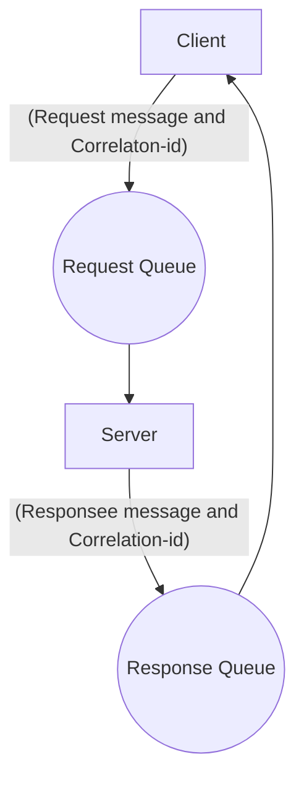

## Request-Response Pattern using Spring AMQP

This project demonstrates ability to appliy request-response pattern using Spring AMQP.

### Advantages

- **Scalable**: This pattern can be scaled up easily by adding more nodes to the network, making it ideal for large systems with high traffic volumes.
- **Simple and Easy to Implement**: The Request-Response Design Pattern is easy to understand and implement, making it a popular choice for developers.
- **Versatile**: The different types of this pattern allow for versatility in the implementation, making it adaptable to different use cases and scenarios.
- **Secure**: By design, the Request-Response Design Pattern allows for secure communication between components of a system, as each request and response message can be encrypted and verified.

### Disadvantages

- **Limited Performance**: In some cases, the Request-Response Design Pattern can lead to decreased performance due to the overhead of creating and managing request and response messages.
- **Increased Complexity**: As a system grows in complexity, managing and tracking the various request and response messages can become more difficult, leading to increased complexity.
- **Reliance on Network**: The Request-Response Design Pattern relies heavily on the network for communication between components, which can be a disadvantage in situations where the network is slow or unreliable.
- **Synchronization Issues**: Synchronization issues can occur when the sender is waiting for a response and the receiver is busy processing other requests, leading to potential performance issues and delays.

### Mechanism

